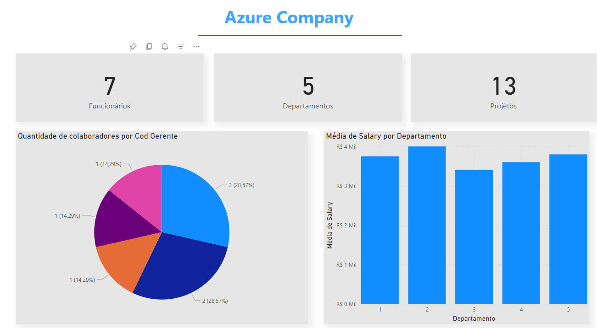

</h1>
<h1>
   Azure Company - Power Bi
</h1>

## Tecnologias Usadas 👩‍💻

 

## Visão Geral
 <b>O objetivo desse Projeto foi integrar o MYSQL e Azure ao Power BI. </b>

## O que foi feito?
<b>
-Instancia do MYSQL na nuvem Azure 
-Criada a base de dados e populada  
-Integração do Power BI com mysql no azure  
-Transformar os dados detalhadamente
 </b>

## Contéudo do Relatório
### Página 1

    
## Contato
   ### Autora: Rebeca vitória
   ### Email: bebecavitoria4738@gmail.com
   ### Linkedin: https://www.linkedin.com/in/rebecavitoriadev/
   

       

  
