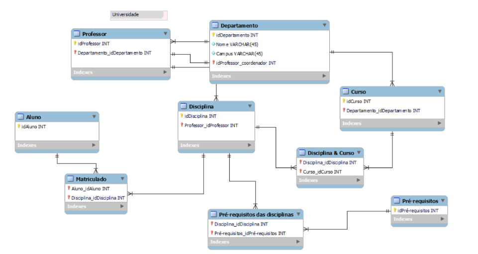
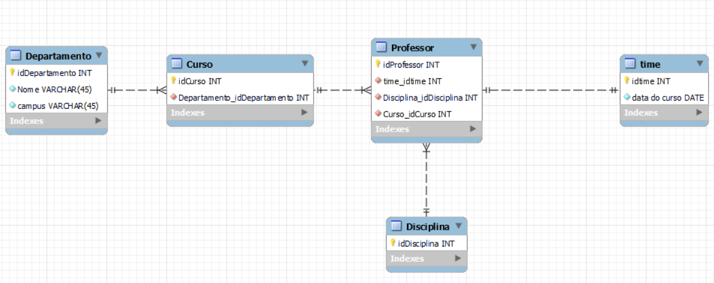
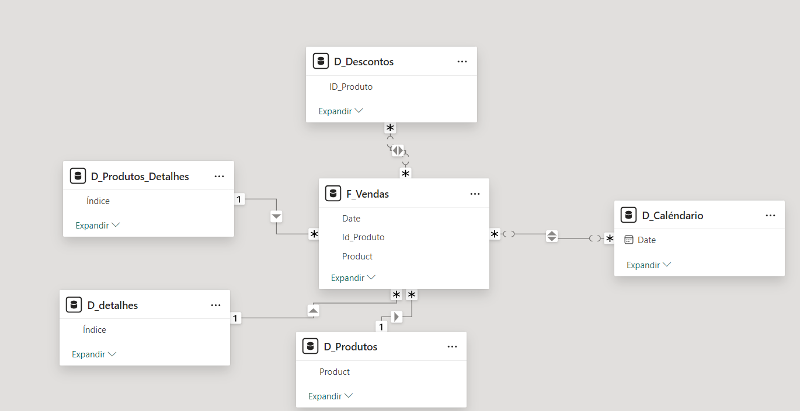

</h1>
<h1>
   Modelando dados- Power Bi
</h1>

 

## Visão Geral
 <b>A partir de um modelo de banco de dados relacional, fiz a modelagem dimensional star schema 
 o Foco da análise dos dados são os professores, Portanto a tabela fato é a de Professor.</b>

## Modelagem
### Modelo relacional

### Modelo dimensional

## Outro Exemplo de modelagem e transformação de dados

<b>A partir de uma tabela, criei um modelo star schema com tabelas de dimensão e uma de foco com o intuito de fazer a análise de dados de Vendas</b>

## Importância da modelagem
<b> A modelagem de dados em estrela (Star Schema) no Power BI é importante porque facilita a análise e o desempenho dos relatórios. Ela organiza  os dados em uma estrutura simples, com uma tabela central (fato) contendo dados numéricos, conectada a várias tabelas dimensionais que contêm  informações descritivas. Isso otimiza consultas, simplifica a criação de relatórios e melhora a performance ao reduzir a complexidade das relações entre os dados, tornando a análise mais rápida e eficiente.</b>    

## Contato
   ### Autora: Rebeca vitória
   ### Email: bebecavitoria4738@gmail.com
   ### Linkedin: https://www.linkedin.com/in/rebecavitoriadev/
   

       

  
