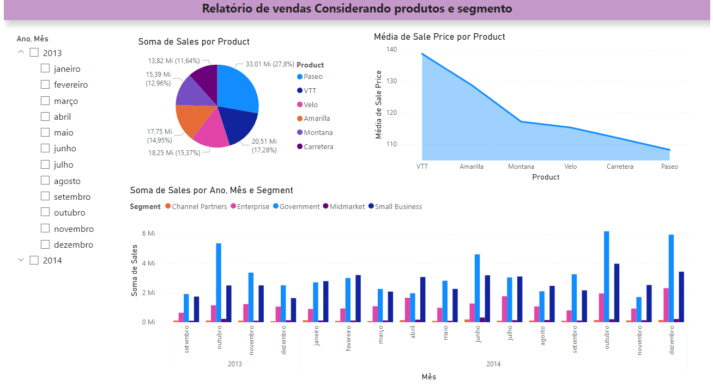
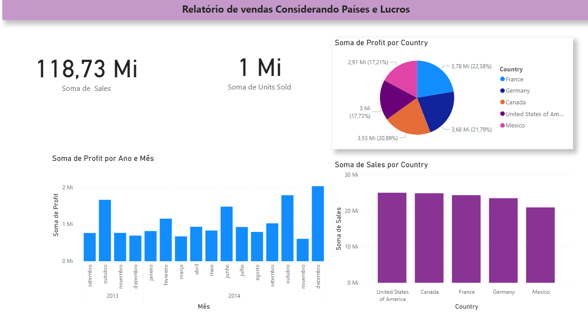
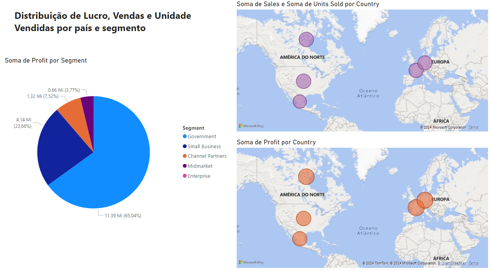

</h1>
<h1>
   Relátorio de Vendas - Power Bi📈🏷️
</h1>

## Tecnologias Usadas 👩‍💻

 

## Visão Geral
 <b>Este relatório de vendas foi criado para fornecer uma visão geral das vendas, lucros e unidades vendidas, segmentadas por produto, ano, mês e país. </b>

## Contéudo do Relatório
### Página 1

Exibe a soma total das vendas para cada produto,  
Inclui a média de preço de venda por produto,  
Apresenta a soma das vendas agrupadas por ano, mês e diferentes segmentos de mercado, como Parceiros de Canal, Empresas, Governo, Mercado Intermediário e Pequenos Negócios.

### Página 2
 

 Exibe a soma das vendas e o lucro total por país, incluindo Estados Unidos, Canadá, França, Alemanha e México,  
   Mostra a quantidade de unidades vendidas por país. 

### Página 2

 Exibe a distribuição de lucro por segmento,  
     Exibe a soma de vendas e a soma de lucros por distribuição geográfica

## Objetivo do Relatório

Este relatório foi desenvolvido para ajudar a:  
Identificar os produtos mais vendidos e com maior receita. 
Analisar a performance de vendas ao longo do tempo e entre diferentes segmentos de mercado. 
Avaliar o lucro por região geográfica e definir estratégias de mercado.

    
## Contato
   ### Autora: Rebeca vitória
   ### Email: bebecavitoria4738@gmail.com
   ### Linkedin: https://www.linkedin.com/in/rebecavitoriadev/
   ### Arquivo: https://drive.google.com/file/d/1iSJkU5lep93IPpf-Kt_8qpx0vfudYjFl/view?usp=sharing

       

  
