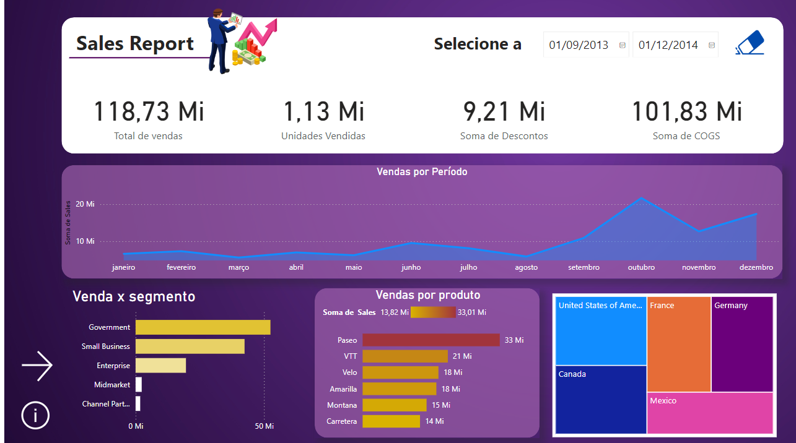
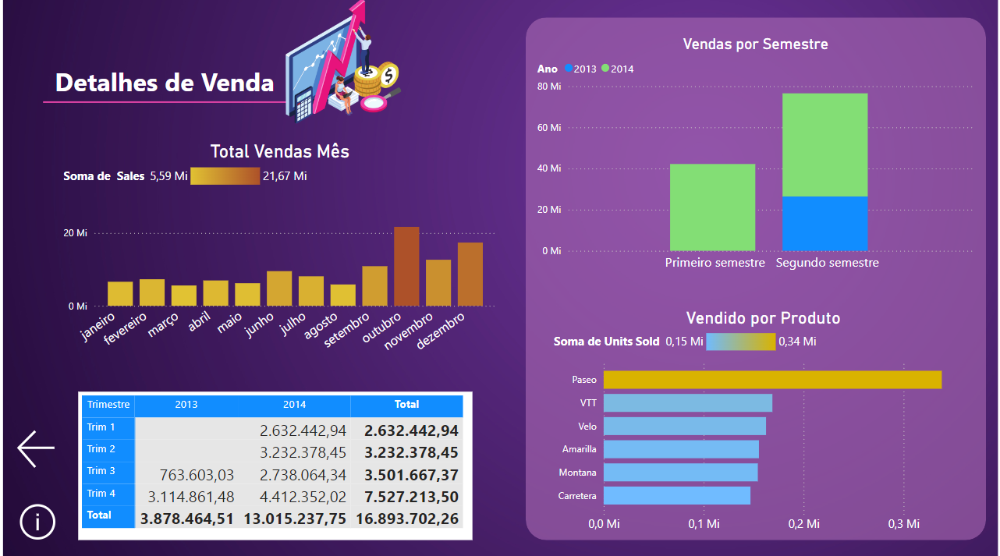

</h1>
<h1>
   Report Financeiro - Power Bi
</h1>

## Tecnologias Usadas 👩‍💻

 

## Visão Geral
 <b> o objetivo desse projeto foi desenvolver um relatório interativo para monitorar o desempenho de vendas de uma empresa. </b>

## Principais Funcionalidades
<b>
- Monitorar o total de vendas, unidades vendidas e soma de descontos
 
-Análise de Vendas por período e País 
-Identificar a quantidade de vendas por segmentos</b>

## Contéudo do Relatório
### Página 1

### Página 2

### Página 3

    
## Contato
   ### Autora: Rebeca vitória
   ### Email: bebecavitoria4738@gmail.com
   ### Linkedin: https://www.linkedin.com/in/rebecavitoriadev/
   ### Arquivo: está anexado a pasta ReportFinanceiro

    