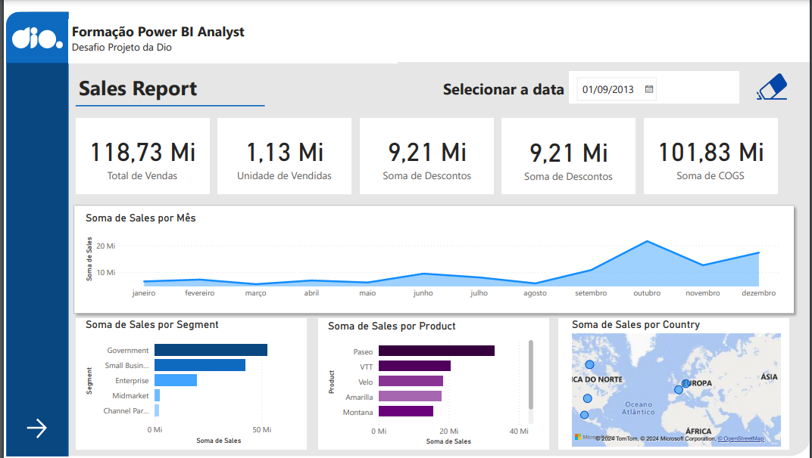
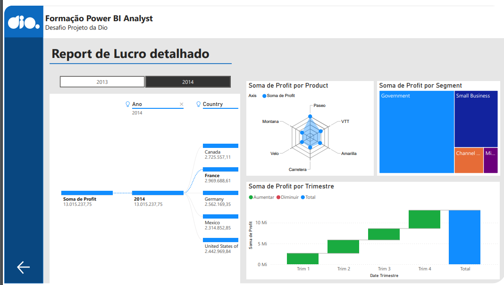

</h1>
<h1>
   Relátorio de Vendas 2 - Power Bi
</h1>

## Tecnologias Usadas 👩‍💻

 

## Visão Geral
 <b>Este relatório de vendas foi criado para fornecer uma visão geral das vendas, lucros e unidades vendidas, segmentadas por produto, ano, mês, país e tipo de cliente. </b>

## Contéudo do Relatório
### Página 1

### Página 2

## Objetivo do Relatório

Utilizando a mesma Base de dados do projeto de vendas anterior, criei um novo template para relatório interativo com botões de ir para próxima página e voltar, além de limpar o segmentador de dados.

    
## Contato
   ### Autora: Rebeca vitória
   ### Email: bebecavitoria4738@gmail.com
   ### Linkedin: https://www.linkedin.com/in/rebecavitoriadev/
   ### Aruivo: https://drive.google.com/file/d/1eyAZqFkLKIstQjSuOd-IsH777-07hOtW/view?usp=sharing

       

  
